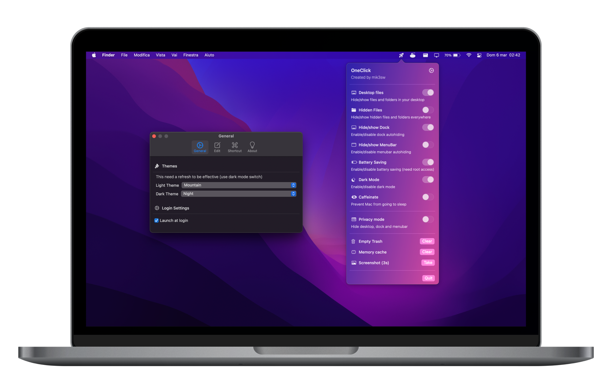
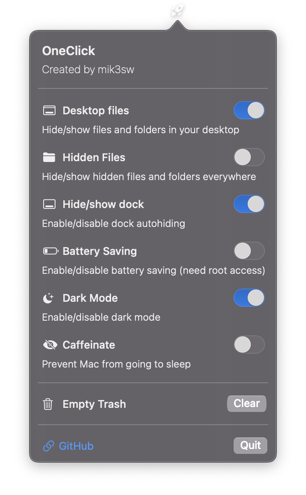

# 🚀 OneClick


<div align="center">
  
  </div>
<br><br>



This simple menubar app can give you quick access to some macOS functions.
It only emulates terminal commands from a GUI

* macOS 12.x (Monterey)
* Intel app
* Apple Silicon app

## 💾 [Downloads](https://github.com/mik3sw/OneClick/releases) 
[]() 

## 🖥 Functions v 1.4 stable

### Hide/Show desktop
Commands:

* ```defaults write com.apple.finder CreateDesktop false ; killall Finder```
* ```defaults write com.apple.finder CreateDesktop true ; killall Finder```


### Hide/Show hidden files/folders
Commands:

* ```defaults write com.apple.finder AppleShowAllFiles -boolean true ; killall Finder```
* ```defaults write com.apple.finder AppleShowAllFiles -boolean false ; killall Finder```

### Hide/Show dock
Commands:

* ```osascript -e 'tell application \"System Events\" to set the autohide of the dock preferences to true'```
* ```osascript -e 'tell application \"System Events\" to set the autohide of the dock preferences to false'```

### Enable/disable power saving
Commands:

* ```osascript -e 'do shell script \"pmset -a lowpowermode 1\" with administrator privileges'```
* ```osascript -e 'do shell script \"pmset -a lowpowermode 0\" with administrator privileges'```
* these commands need root access (the app will ask for administrator password or touchID)

### Enable/disable dark mode
Commands:

* ```osascript -e 'tell application \"System Events\" to tell appearance preferences to set dark mode to true'```
* ```osascript -e 'tell application \"System Events\" to tell appearance preferences to set dark mode to false'```


### Caffeinate
Commands:

* ```caffeinate```
* ```killall caffeinate```


### Empty trash
Command:

* ```osascript -e 'tell application \"Finder\" to empty trash'```

### Clear memory
Command:

* ```osascript -e 'do shell script \"purge\" with administrator privileges'```

### Take screenshot
Command:

* ```screencapture -T 3 -t png -P Desktop/screenshot.png```


<br><br>

<div align="center">
  
</div>


