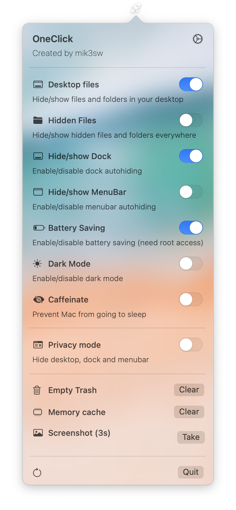
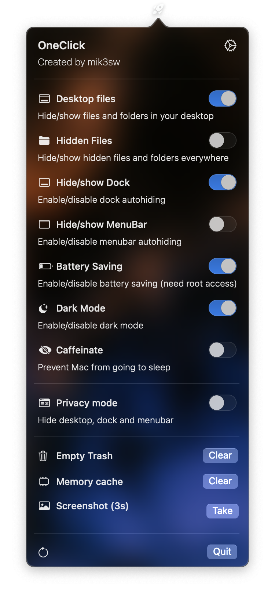

# OneClick

<div align="center">
  
  </div>
<br><br>


OneClick can give you quick access to some macOS functions from MenuBar!

* **macOS 12.x** (Monterey)
* **Intel app** (only 1.4 and before)
* **Apple Silicon app** (all versions)

## 💾 Downloads 
[]() 

**Support me with a star!** ⭐️ 

* [Releases](https://github.com/mik3sw/OneClick/releases)
* HomeBrew soon ...

> OneClick 2.x is currently in beta i need to fix some errors and bugs

> This is a hobbyist app


<details>
<summary>Show functions</summary>
<br>

### Hide/Show desktop
Commands:

* ```defaults write com.apple.finder CreateDesktop false ; killall Finder```
* ```defaults write com.apple.finder CreateDesktop true ; killall Finder```


### Hide/Show hidden files/folders
Commands:

* ```defaults write com.apple.finder AppleShowAllFiles -boolean true ; killall Finder```
* ```defaults write com.apple.finder AppleShowAllFiles -boolean false ; killall Finder```

### Hide/Show dock
Commands:

* ```osascript -e 'tell application \"System Events\" to set the autohide of the dock preferences to true'```
* ```osascript -e 'tell application \"System Events\" to set the autohide of the dock preferences to false'```

### Enable/disable power saving
Commands:

* ```osascript -e 'do shell script \"pmset -a lowpowermode 1\" with administrator privileges'```
* ```osascript -e 'do shell script \"pmset -a lowpowermode 0\" with administrator privileges'```
* these commands need root access (the app will ask for administrator password or touchID)

### Enable/disable dark mode
Commands:

* ```osascript -e 'tell application \"System Events\" to tell appearance preferences to set dark mode to true'```
* ```osascript -e 'tell application \"System Events\" to tell appearance preferences to set dark mode to false'```


### Caffeinate
Commands:

* ```caffeinate```
* ```killall caffeinate```


### Empty trash
Command:

* ```osascript -e 'tell application \"Finder\" to empty trash'```

### Clear memory
Command:

* ```osascript -e 'do shell script \"purge\" with administrator privileges'```

### Take screenshot
Command:

* ```screencapture -T 3 -t png -P Desktop/screenshot.png```

</details>


## ⚙️ Settings

From settings you can select Themes (dark and light), "launch at login" function and edit the main view elements.

| General  |  Edit  | Custom Toggles |
|---|---|---|
|   |   |  |


## Custom Toggles (Beta)
> This is a beta feature, you can only add one custom toggle 


## 🎨 Themes

Here a preview of light and dark themes


|   |   |   |   |   |   |
|---|---|---|---|---|---|
|   |   |   |   |   |  |
|   |   |   |   |   |   |

## ToDo

- [ ] Select theme image from storage
- [x] Persistent data (at the moment settings will reset if you close the app)
- [ ] New Functions
- [x] Custom toggles

## Reviews

* [MacUpdate](https://www.macupdate.com/app/mac/63828/oneclick)
* [Softpedia](https://mac.softpedia.com/get/System-Utilities/mik3sw-OneClick.shtml)

## Credits

* [Launch at login](https://github.com/sindresorhus/LaunchAtLogin) 
